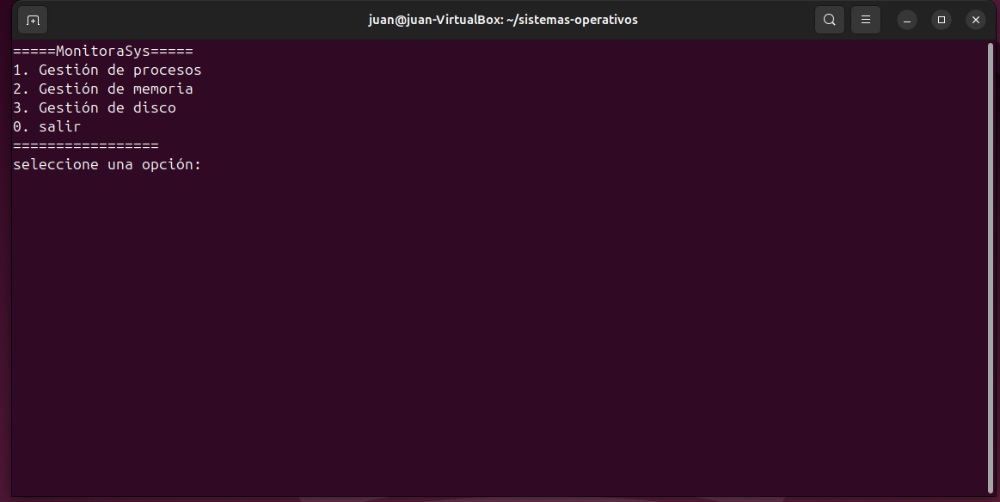
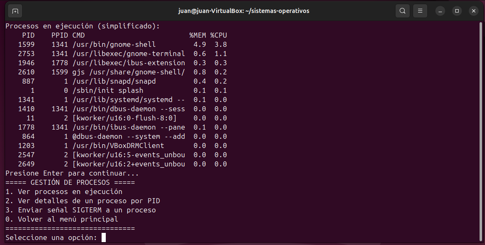
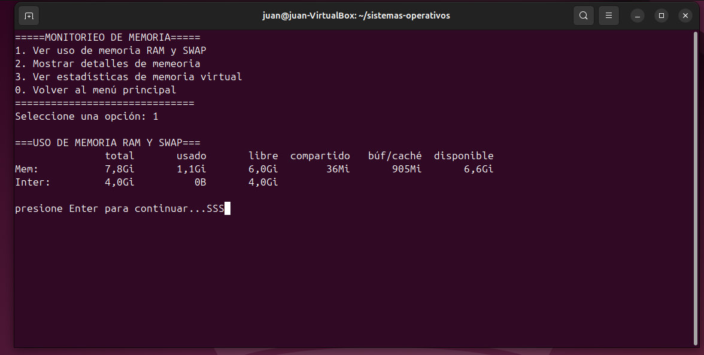
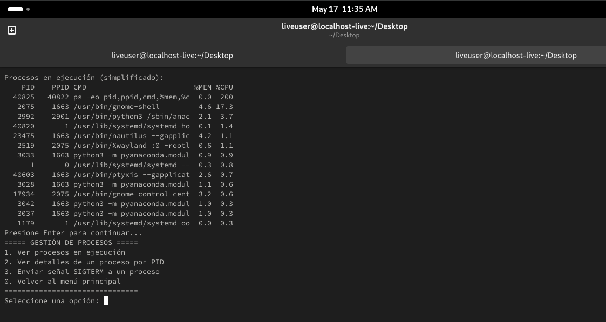
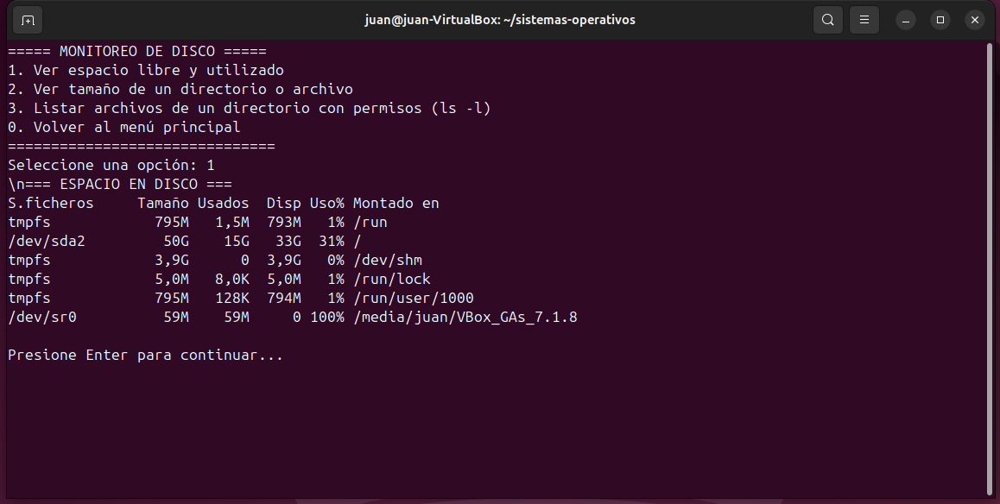

<h1>MonitoraSys – Herramienta de Monitoreo de Sistemas</h1>

  
  
  

<h2>💡 ¿Qué es MonitoraSys?</h2>

  <strong>MonitoraSys</strong> es una herramienta desarrollada en Bash que permite a los usuarios monitorear y gestionar procesos del sistema operativo GNU/Linux.
  Este proyecto fue creado como parte del curso de <strong>Sistemas Operativos</strong> del ISPC, y está pensado para ser utilizado dentro de una máquina virtual Ubuntu.

<h2>📄 Guía para Ejecutar MonitoraSys en Ubuntu (VirtualBox)</h2>

<ol>
  <li><strong>Iniciar Ubuntu:</strong> Iniciá la máquina virtual Ubuntu desde <strong>VirtualBox</strong>.</li>
  <li><strong>Abrir Terminal:</strong> Presioná <code>Ctrl + Alt + T</code> para abrir la terminal.</li>
  <li><strong>Verificar si tenés Git:</strong>
    <pre><code>git --version</code></pre>
    Si no lo tenés, instalalo con:
    <pre><code>sudo apt update
sudo apt install git -y</code></pre>
  </li>
  <li><strong>Clonar el repositorio:</strong>
    <pre><code>git clone https://github.com/ProCoders-ISPC/sistemas-operativos.git</code></pre>
  </li>
  <li><strong>Acceder al proyecto:</strong>
    <pre><code>cd sistemas-operativos</code></pre>
  </li>
  <li><strong>Dar permisos de ejecución:</strong>
    <pre><code>chmod +x main.sh src/disco.sh src/memoria.sh src/procesos.sh</code></pre>
  </li>
  <li><strong>Ejecutar la herramienta:</strong>
    <pre><code>./main.sh</code></pre>
  </li>
</ol>

<h2>⚙️ Funcionalidades: </h2>

Desde el menú principal (main.sh) podés acceder a 3 opciones, Gestión de Memoria, Gestión de Disco y Gestión de Procesos:

 

La <strong>opción 1</strong> ejecutará el script <code>procesos.sh</code>, el cual permite:

<ul>
  <li>📄 Listar los procesos en ejecución</li>
  <li>🔍 Buscar un proceso por su nombre</li>
  <li>❌ Finalizar un proceso mediante su PID</li>
</ul>

<h2>⚙️ Funcionalidad: Gestión de Procesos</h2>

Desde el menú principal podés acceder a la gestión de procesos:

 

Esta funcionalidad está diseñada para simplificar la administración del sistema sin necesidad de comandos complejos.

La <strong>opción 2</strong> ejecutará el script <code>memoria.sh</code>, el cual permite:

<ul>
  <li>🧩 Visualizar el uso de memoria RAM y SWAP</li>
  <li>🔍 Mostrar detalles de memoria</li>
  <li>📊 Ver estadísticas de memoria virtual</li>
</ul>

<<<<<<< HEAD
 
=======
 
>>>>>>> 2f7ba27e55f5ecb33e0cdaaa8d433ecd744647c0

Esta funcionalidad está diseñada para facilitar la visualización del uso de las memorias del sistema.

La <strong>opción 3</strong> ejecutará el script <code>disco.sh</code>, el cual permite:

<ul>
  <li>💾 Visualizar el espacio libre y utilizado del disco.</li>
  <li>📂 Ver tamaño de un directorio o archivo.</li>
  <li>🗃️ Listar archivos de un directorio con permisos.</li>
</ul>

 

Esta funcionalidad está diseñada para simplificar la administración del sistema sin necesidad de comandos complejos.

La <strong>opción 2</strong> ejecutará el script <code>memoria.sh</code>, el cual permite:

<ul>
  <li>🧩 Visualizar el uso de memoria RAM y SWAP</li>
  <li>🔍 Mostrar detalles de memoria</li>
  <li>📊 Ver estadísticas de memoria virtual</li>
</ul>

 

Esta funcionalidad está diseñada para facilitar la visualización del uso de las memorias del sistema.

La <strong>opción 3</strong> ejecutará el script <code>disco.sh</code>, el cual permite:

<ul>
  <li>💾 Visualizar el espacio libre y utilizado del disco.</li>
  <li>📂 Ver tamaño de un directorio o archivo.</li>
  <li>🗃️ Listar archivos de un directorio con permisos.</li>
</ul>

 

Esta funcionalidad está diseñada para monitorear el espacio del disco y el tamaño de los archivos.

<h2>📁 Estructura del Proyecto</h2>
<pre><code>sistemas-operativos/
├── 📁img/
├── 📁src/
│   ├── disco.sh
│   ├── memoria.sh
│   └── procesos.sh
├── main.sh
└── README.md
</code></pre>

<h2>🛠️ Requisitos</h2>
<ul>
  <li>Ubuntu 22.04 o superior (recomendado en VirtualBox)</li>
  <li>Bash Shell</li>
  <li>Git</li>
</ul>

<h2>👥 Autores</h2>

<strong>ProCoders – ISPC</strong>

<ul>
  <li>Daniel Nicolás Paez - Desarrollador</li>
  <li>Laura Micaela Zarate - Scrum Master</li>
  <li>Cristian Isaac Vargas - Desarrollador</li>
  <li>Juan Pablo Sánchez Brandán – Desarrollador</li>
  <li>Karina del Valle Quinteros – Desarrolladora</li>
  <li>Juan Ignacio Gioda – Desarrollador</li>
</ul>

<blockquote><em>Desarrollado por estudiantes de la Tecnicatura en Desarrollo de Software – ISPC</em></blockquote>

